# 🌊 FlowyML Notebook

<p align="center">
  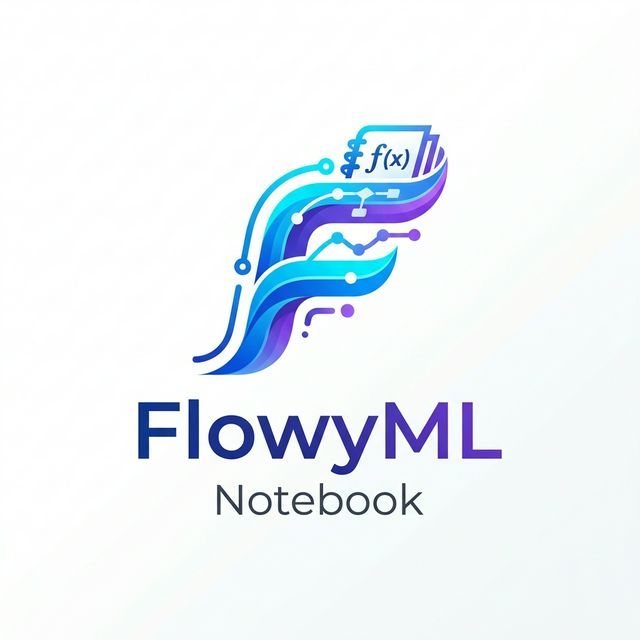
  <br>
  <em>The Reactive Notebook That Ships to Production</em>
  <br>
  <br>
  <a href="https://github.com/UnicoLab/flowyml-notebook/actions/workflows/UTESTS.yml"></a>
  <a href="https://pypi.org/project/flowyml-notebook/"></a>
  <a href="https://www.python.org/downloads/"></a>
  <a href="LICENSE"></a>
  <a href="https://unicolab.ai"></a>
</p>

---

**FlowyML Notebook** is a **reactive, DAG-powered** notebook environment that replaces Jupyter for production ML workflows. Write pure Python cells, get **automatic dependency tracking**, and ship directly to pipelines, dashboards, and apps — without changing a single line of code.

<p align="center">
  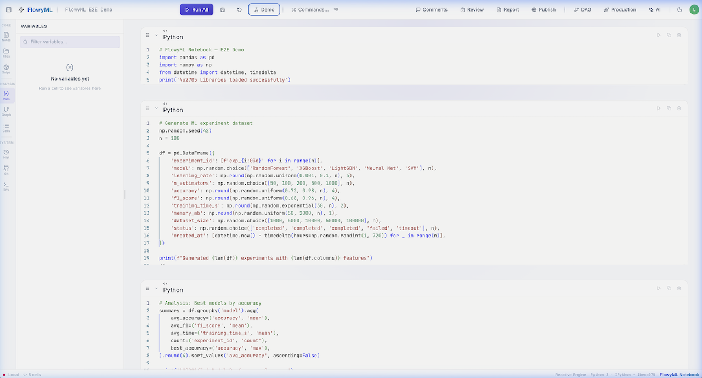
  <br>
  <em>Reactive notebook editor with code cells, variable explorer, and full toolbar</em>
</p>

---

## 🚀 Why FlowyML Notebook?

| Feature | Jupyter | Deepnote | Marimo | **FlowyML Notebook** |
|---------|:-------:|:--------:|:------:|:--------------------:|
| **Reactive DAG Execution** | ❌ | ❌ | ✅ | ✅ |
| **Pure `.py` File Storage** | ❌ | ❌ | ✅ | ✅ |
| **Git-Native Collaboration** | ❌ | ⚠️ Cloud | ❌ | ✅ GitHub |
| **Pipeline Integration** | ❌ | ❌ | ❌ | ✅ FlowyML |
| **Reusable Recipes** | ❌ | ❌ | ❌ | ✅ |
| **One-Click Deploy** | ❌ | ⚠️ Cloud | ❌ | ✅ |
| **SQL First-Class** | ❌ | ✅ | ✅ | ✅ |
| **AI Assistant** | ❌ | ✅ | ❌ | ✅ |
| **Rich Data Explorer** | ❌ | ✅ | ✅ | ✅ |
| **App Mode** | ❌ | ❌ | ✅ | ✅ |
| **Self-Hosted** | ✅ | ❌ | ✅ | ✅ |
| **SmartPrep Advisor** | ❌ | ❌ | ❌ | ✅ |
| **Algorithm Matchmaker** | ❌ | ❌ | ❌ | ✅ |
| **Interactive Dashboards** | ❌ | ❌ | ❌ | ✅ |
| **Analysis Patterns** | ❌ | ❌ | ❌ | ✅ |

---

## ⚡ Quick Start

```bash
# Install the core package
pip install flowyml-notebook

# Or install with all ML & AI extensions
pip install "flowyml-notebook[all]"
```

```bash
fml-notebook dev    # 🔥 Hot-reload development mode
fml-notebook start  # 🚀 Production build
```

The browser opens automatically. You're ready to build.

---

## 🌟 Features

### 📊 Rich Data Exploration

Every DataFrame gets **automatic profiling** — statistics, distributions, correlations, quality checks, and ML-ready insights. No extra code needed.

<p align="center">
  
  <br>
  <em>Automatic DataFrame profiling with column statistics, type detection, and memory impact</em>
</p>

<p align="center">
  
  <br>
  <em>Interactive charts for every column — histograms, bar charts, and distribution analysis</em>
</p>

<p align="center">
  
  <br>
  <em>Pearson correlation matrix with color-coded heatmap for quick feature analysis</em>
</p>

<p align="center">
  
  <br>
  <em>Automated ML insights: outlier detection, scaling recommendations, and target variable suggestions</em>
</p>

---

### 🔄 Reactive DAG Engine

Cells are nodes in a **dependency graph**. Change a variable, and only dependent cells re-execute — automatically. Visualize the full pipeline with the built-in DAG view.

<p align="center">
  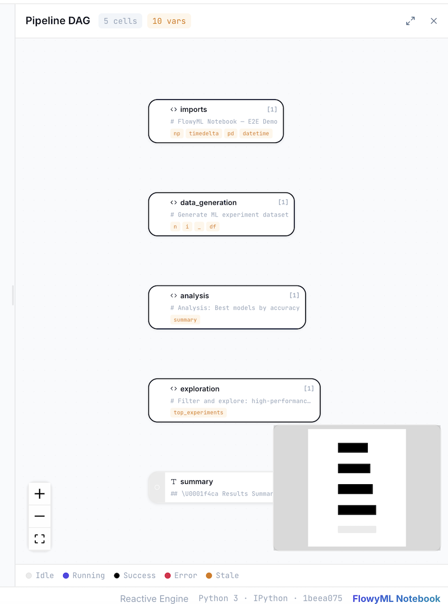
  <br>
  <em>Visual dependency graph showing data flow: imports → data_generation → analysis → exploration → summary</em>
</p>

---

### 🧾 Recipes — Reusable Code Templates

Stop rewriting boilerplate. **39 built-in recipes** across Core, Assets, Parallel, Observability, Evals, Data, ML, and Visualization categories. Drag into your notebook or click to insert.

<p align="center">
  
  <br>
  <em>Searchable recipe library with FlowyML Step, Pipeline, Conditional Branching, and more</em>
</p>

---

### 💬 Comments & Review

Collaborate directly in the notebook with **inline comments** and a review panel. Add notebook-level or cell-level annotations for team discussions.

<p align="center">
  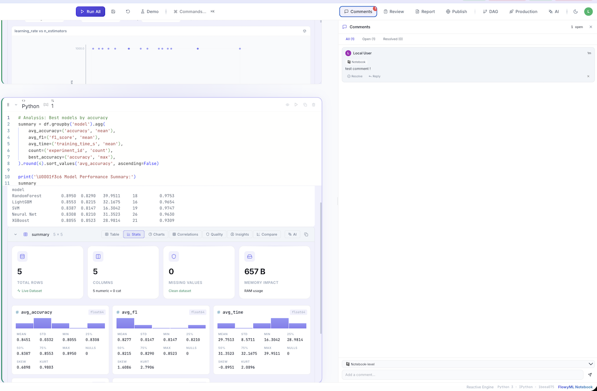
  <br>
  <em>Comments panel with threaded discussions, resolve/reply actions, and scatter plot output</em>
</p>

---

### 📄 Reports — One-Click Export

Generate beautiful **HTML or PDF reports** from your notebook. Optionally include source code cells alongside outputs. Preview in browser, then download.

<p align="center">
  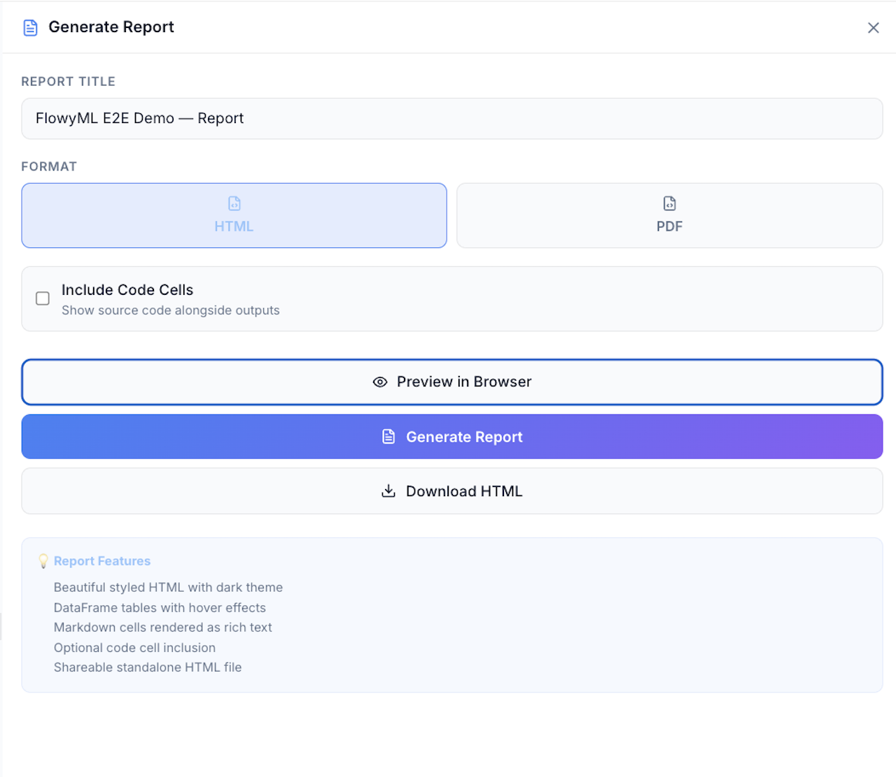
  <br>
  <em>Report generation with HTML/PDF format selection, code inclusion toggle, and instant preview</em>
</p>

---

### 🌐 Publish as App

Turn any notebook into an **interactive web application** with one click. Choose layout (Linear, Grid, Tabs, Sidebar, Dashboard), theme, and cell visibility.

<p align="center">
  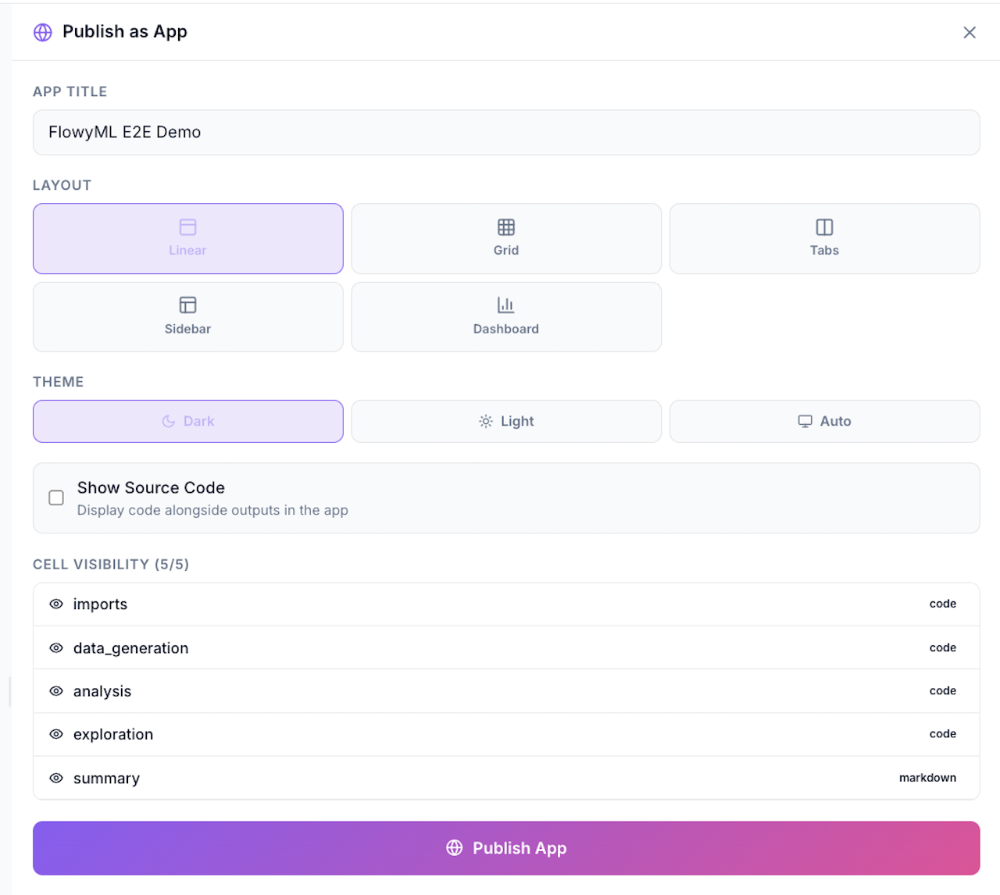
  <br>
  <em>Publish dialog with layout options, dark/light/auto theme, source code toggle, and per-cell visibility</em>
</p>

---

### 🚀 Production — Pipelines, Deploy & Assets

Ship notebooks directly to production. **Promote to pipeline**, deploy as API/Docker/Batch, track kernel assets (DataFrames, models), and connect to FlowyML infrastructure.

<table>
  <tr>
    <td width="50%" align="center">
      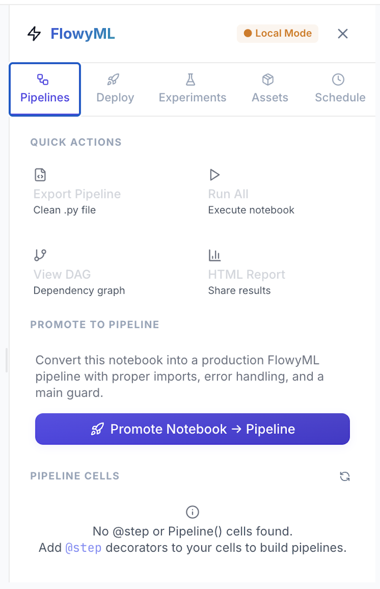
      <br>
      <em>Pipeline promotion with quick actions and @step decorators</em>
    </td>
    <td width="50%" align="center">
      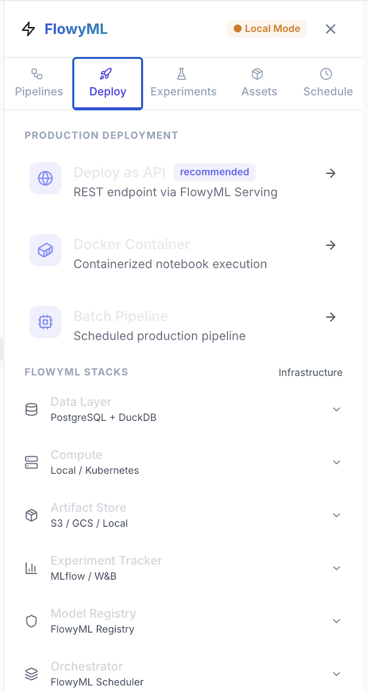
      <br>
      <em>Deploy as API, Docker Container, or Batch Pipeline with infrastructure stacks</em>
    </td>
  </tr>
</table>

<p align="center">
  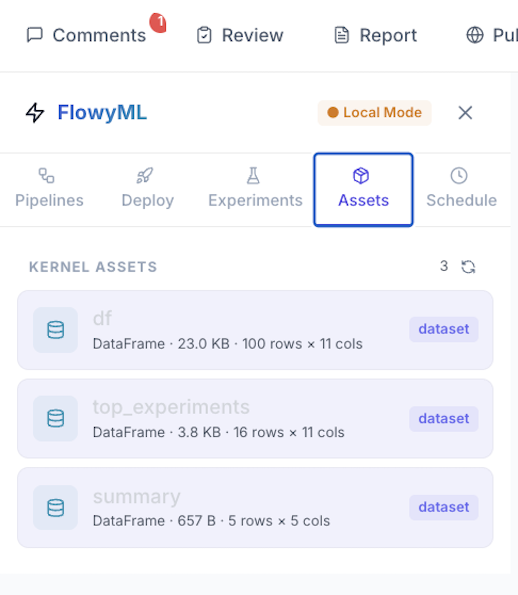
  <br>
  <em>Kernel assets: tracked DataFrames with size, shape, and type metadata</em>
</p>

---

### 🤝 Git & Version Control

Full **GitHub integration** as the collaboration backend. Link a repository, branch, commit, and push — all from the notebook sidebar. No proprietary cloud needed.

<table>
  <tr>
    <td width="50%" align="center">
      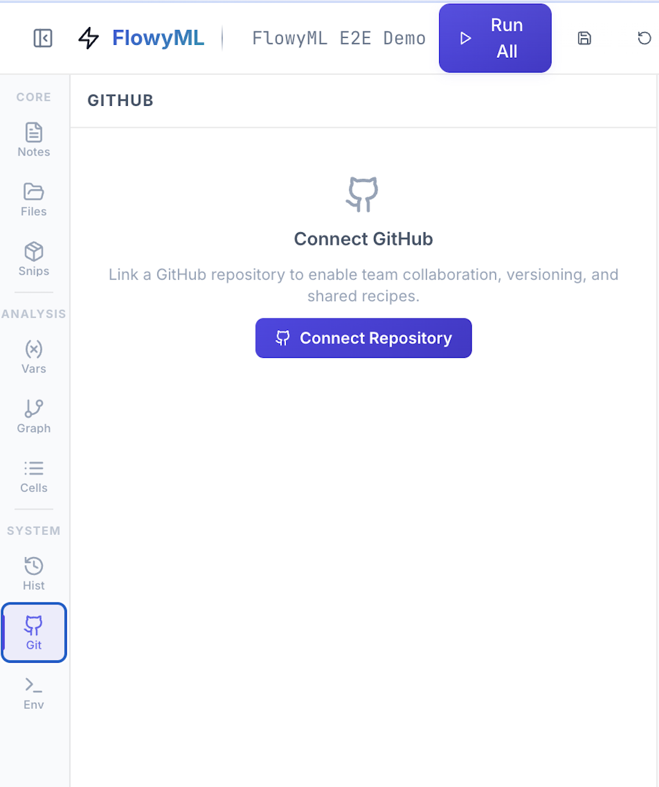
      <br>
      <em>Connect GitHub repository for team collaboration and versioning</em>
    </td>
    <td width="50%" align="center">
      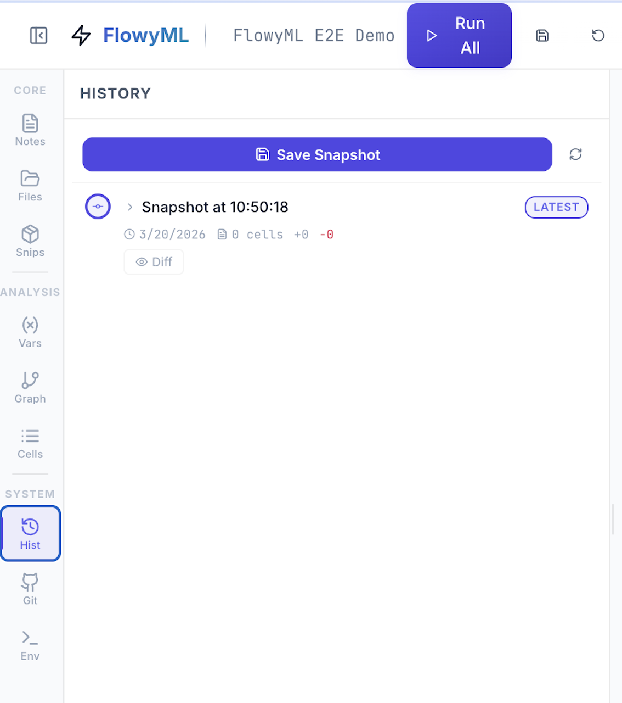
      <br>
      <em>Save and browse notebook snapshots with cell-level diffs</em>
    </td>
  </tr>
</table>

---

### ⚙️ Environment & FlowyML Connection

Run **standalone** (Local Mode) or connect to a **FlowyML server** (Remote Mode) for experiment tracking, pipeline export, and deployment. Full runtime details at a glance.

<p align="center">
  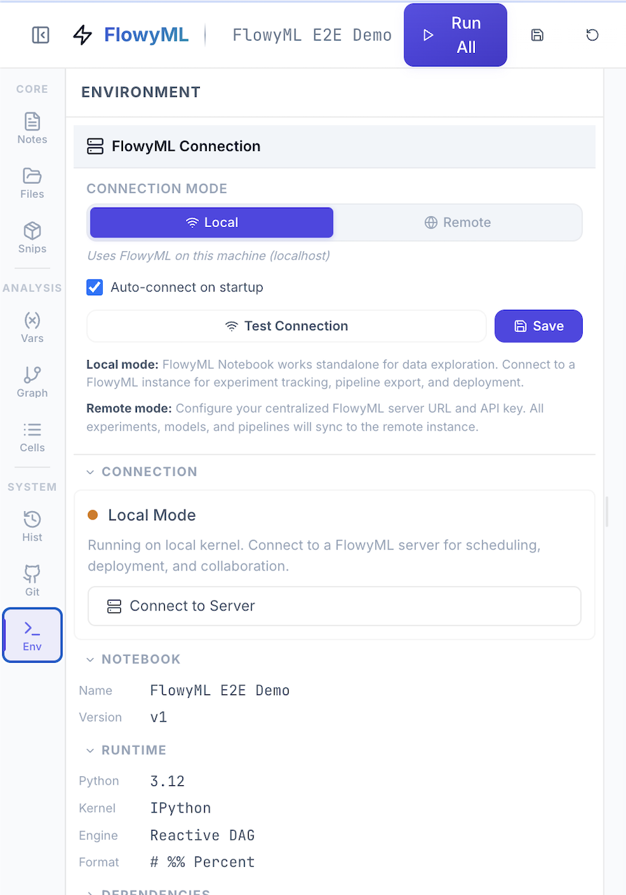
  <br>
  <em>Environment panel: Local/Remote connection, runtime info (Python 3.12, IPython, Reactive DAG engine)</em>
</p>

---

## 🛠️ CLI Reference

| Command | Description |
|---------|-------------|
| `fml-notebook dev` | 🔥 Launch with Vite hot reload |
| `fml-notebook start` | 🚀 Launch with production build |
| `fml-notebook run <file>` | ▶️ Execute a notebook headlessly |
| `fml-notebook export <file>` | 📦 Export as pipeline/HTML/PDF/Docker |
| `fml-notebook app <file>` | 🌐 Deploy as interactive web app |
| `fml-notebook list --server <URL>` | 📚 List notebooks on a server |

---

## 📚 Documentation

Visit **[FlowyML Notebook Docs](https://unicolab.github.io/flowyml-notebook/latest/)** for the complete guide:

- **[Getting Started](https://unicolab.github.io/flowyml-notebook/latest/getting-started)** — Install, launch, configure
- **[Features](https://unicolab.github.io/flowyml-notebook/latest/features)** — Complete feature inventory
- **[Architecture](https://unicolab.github.io/flowyml-notebook/latest/architecture)** — Reactive DAG engine internals
- **[Recipes](https://unicolab.github.io/flowyml-notebook/latest/recipes)** — Reusable cell templates
- **[Collaboration](https://unicolab.github.io/flowyml-notebook/latest/collaboration)** — GitHub-based team workflows
- **[Integration](https://unicolab.github.io/flowyml-notebook/latest/integration)** — FlowyML instance connections
- **[Data Exploration](https://unicolab.github.io/flowyml-notebook/latest/exploration)** — Rich DataFrame profiling
- **[API Reference](https://unicolab.github.io/flowyml-notebook/latest/api)** — CLI & Python API docs

---

## 🛠️ Development

```bash
git clone https://github.com/UnicoLab/flowyml-notebook.git
cd flowyml-notebook
make setup
make dev
```

| Target | Description |
|--------|-------------|
| `make setup` | 🔧 Install Python package + frontend deps |
| `make dev` | 🔥 Launch dev mode with hot reload |
| `make test` | 🧪 Run all tests |
| `make lint` | 🔍 Run Ruff linter |
| `make format` | ✨ Auto-format code |
| `make docs` | 📖 Build MkDocs documentation |
| `make docs-serve` | 👁️ Preview docs locally |
| `make pre-commit` | 🔒 Run pre-commit checks |
| `make release-dry-run` | 🏷️ Dry-run semantic release |
| `make clean` | 🧹 Remove build artifacts |

See [CONTRIBUTING.md](CONTRIBUTING.md) for the full contributor guide.

---

## 🤝 Community

- 📖 [Documentation](https://unicolab.github.io/flowyml-notebook/latest/)
- 🐛 [Bug Reports](https://github.com/UnicoLab/flowyml-notebook/issues)
- 💬 [Discussions](https://github.com/UnicoLab/flowyml-notebook/discussions)
- 📋 [Contributing Guide](CONTRIBUTING.md)
- 📜 [Changelog](CHANGELOG.md)
- 🔒 [Security Policy](SECURITY.md)
- 📝 [Code of Conduct](CODE_OF_CONDUCT.md)

---

## 📄 License

Licensed under the [Apache License 2.0](LICENSE).

<p align="center">
  <strong>Built with ❤️ by <a href="https://unicolab.ai">UnicoLab</a></strong>
</p>
