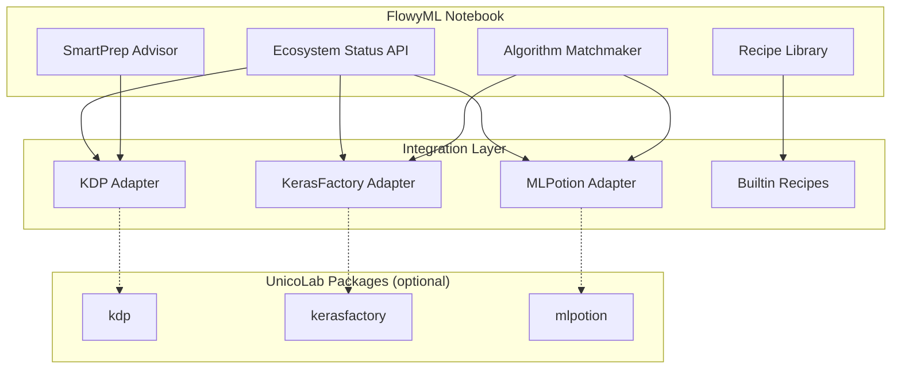

# :unicorn: UnicoLab Keras Ecosystem

FlowyML Notebook natively integrates with the **UnicoLab ML ecosystem** — three open-source packages that work together to give you a complete Keras-based ML workflow: preprocessing, model building, and training.

!!! tip "All packages are optional"
    Adapters gracefully degrade when packages are not installed. SmartPrep and Algorithm Matchmaker still work with scikit-learn — ecosystem packages add **additional** deep-learning recommendations.

---

## Quick Install

```bash
# Install all three ecosystem packages at once
pip install "flowyml-notebook[keras]"

# Or install individually
pip install kdp kerasfactory mlpotion
```

---

## Ecosystem Packages

### :test_tube: KDP — Keras Data Processor

Auto-configure Keras preprocessing layers with intelligent feature type detection.

| Feature | Description |
|---------|-------------|
| **Auto Feature Types** | Maps DataFrame columns to `FeatureType` enums (normalized, categorical, text, etc.) |
| **Distribution-Aware Encoding** | Learns optimal transforms for skewed features |
| **Tabular Attention** | Cross-feature attention layers for complex interactions |
| **In-Model Preprocessing** | Preprocessing deploys as part of your Keras model — no separate pipeline |

**Integration Point:** SmartPrep Advisor — KDP suggestions appear as top-priority "recommended" entries with ready-to-use code.

```python
from kdp import PreprocessingModel, FeatureType

features_specs = {
    "age": FeatureType.FLOAT_NORMALIZED,
    "income": FeatureType.FLOAT_RESCALED,
    "occupation": FeatureType.STRING_CATEGORICAL,
}

preprocessor = PreprocessingModel(
    path_data="data.csv",
    features_specs=features_specs,
    use_distribution_aware=True,
    tabular_attention=True,
)
result = preprocessor.build_preprocessor()
model = result["model"]
model.summary()
```

:link: [KDP Documentation](https://unicolab.github.io/keras-data-processor/) · [GitHub](https://github.com/UnicoLab/keras-data-processor)

---

### :building_construction: KerasFactory — Reusable Keras Layers & Models

38+ production-ready Keras layers and model architectures for tabular data.

| Layer | Use Case |
|-------|----------|
| `BaseFeedForwardModel` | One-liner fully connected model with dropout |
| `GatedResidualNetwork` | Feature-wise gating for complex interactions |
| `TabularAttention` | Self-attention for tabular features |
| `DistributionTransformLayer` | Automatic distribution normalization |
| `GatedFeatureFusion` | Multi-source feature combination |

**Integration Point:** Algorithm Matchmaker — generates two recommendations:

1. **KerasFactory Neural Network** — `BaseFeedForwardModel` with adaptive scoring
2. **KerasFactory Advanced (GRN + Attention)** — Custom architecture with `GatedResidualNetwork` and `DistributionTransformLayer`

```python
import keras
from kerasfactory.layers import (
    DistributionTransformLayer,
    GatedResidualNetwork,
)

inputs = keras.Input(shape=(n_features,))
x = DistributionTransformLayer(transform_type='auto')(inputs)
x = GatedResidualNetwork(units=64)(x)
x = keras.layers.Dropout(0.2)(x)
x = GatedResidualNetwork(units=32)(x)
outputs = keras.layers.Dense(1, activation='sigmoid')(x)

model = keras.Model(inputs, outputs)
model.compile(optimizer='adam', loss='binary_crossentropy', metrics=['accuracy'])
```

:link: [KerasFactory Documentation](https://unicolab.github.io/KerasFactory/latest/) · [GitHub](https://github.com/UnicoLab/KerasFactory)

---

### :alembic: MLPotion — Managed Training Pipelines

Type-safe, reproducible training pipelines for Keras, TensorFlow, and PyTorch.

| Feature | Description |
|---------|-------------|
| `ModelTrainingConfig` | Type-safe configuration — no missing parameters |
| `ModelTrainer` | Managed training with history tracking |
| **Adaptive Hyperparameters** | Auto-adjusts epochs and batch size based on dataset size |
| **Multi-Framework** | Consistent interface across Keras, TF, and PyTorch |

**Integration Point:** Algorithm Matchmaker — generates a "Keras + MLPotion Pipeline" recommendation with managed training.

```python
from mlpotion.frameworks.keras.training import ModelTrainer
from mlpotion.frameworks.keras.config import ModelTrainingConfig

config = ModelTrainingConfig(
    epochs=50,
    batch_size=32,
    optimizer='adam',
    loss='binary_crossentropy',
)

trainer = ModelTrainer(config=config)
history = trainer.train(
    model=model,
    train_data=(X_train, y_train),
    val_data=(X_test, y_test),
)
```

:link: [MLPotion Documentation](https://unicolab.github.io/MLPotion/latest/) · [GitHub](https://github.com/UnicoLab/MLPotion)

---

## End-to-End Pipeline

When all three packages are installed, the **Algorithm Matchmaker** surfaces the flagship recommendation: a complete **KDP → KerasFactory → MLPotion** pipeline that preprocesses, builds, and trains in a single deployable Keras model.

```python
# 🚀 End-to-End UnicoLab ML Pipeline
from kdp import PreprocessingModel, FeatureType
from kerasfactory.layers import GatedResidualNetwork
from mlpotion.frameworks.keras.training import ModelTrainer
from mlpotion.frameworks.keras.config import ModelTrainingConfig
import keras

# Step 1: KDP Preprocessing
features_specs = {
    "feature_1": FeatureType.FLOAT_NORMALIZED,
    "category": FeatureType.STRING_CATEGORICAL,
}
preprocessor = PreprocessingModel(
    path_data="data.csv",
    features_specs=features_specs,
    use_distribution_aware=True,
    tabular_attention=True,
)
prep_result = preprocessor.build_preprocessor()
prep_model = prep_result["model"]

# Step 2: KerasFactory Model
inputs = prep_model.input
x = prep_model.output
x = GatedResidualNetwork(units=64)(x)
x = keras.layers.Dropout(0.2)(x)
x = keras.layers.Dense(32, activation='relu')(x)
outputs = keras.layers.Dense(1, activation='sigmoid')(x)
full_model = keras.Model(inputs=inputs, outputs=outputs)

# Step 3: MLPotion Training
config = ModelTrainingConfig(epochs=50, batch_size=32, optimizer='adam', loss='binary_crossentropy')
trainer = ModelTrainer(config=config)
history = trainer.train(model=full_model, train_data=(X_train, y_train), val_data=(X_test, y_test))

print("🎉 Full UnicoLab pipeline complete!")
```

---

## Ecosystem Status API

Check which ecosystem packages are installed via the REST API:

```
GET /api/ecosystem/status
```

Response:

```json
{
    "packages": [
        {
            "key": "kdp",
            "name": "Keras Data Processor (KDP)",
            "installed": true,
            "version": "1.2.0",
            "install_command": "pip install kdp",
            "docs_url": "https://unicolab.github.io/keras-data-processor/",
            "repo_url": "https://github.com/UnicoLab/keras-data-processor"
        }
    ],
    "installed_count": 3,
    "total_count": 3,
    "fully_integrated": true,
    "install_all": "pip install 'flowyml-notebook[keras]'"
}
```

---

## Builtin Ecosystem Recipes

4 new multi-cell recipes are automatically available in the recipe library:

| Recipe | Package | Description |
|--------|---------|-------------|
| :test_tube: **KDP Smart Preprocessing** | `kdp` | Auto-configure Keras preprocessing layers for your data |
| :building_construction: **KerasFactory Quick Model** | `kerasfactory` | Build a tabular model with production-ready Keras layers |
| :alembic: **MLPotion Training Pipeline** | `mlpotion` | Managed Keras training with type-safe configuration |
| :unicorn: **UnicoLab End-to-End Pipeline** | All 3 | Complete KDP → KerasFactory → MLPotion workflow |

Access these from the **Snips** panel in the sidebar — they appear alongside your custom and shared recipes.

---

## Architecture

The ecosystem integration uses a **graceful degradation** pattern:



- **Solid arrows**: Always active
- **Dashed arrows**: Only when package is installed
- Adapters generate code snippets and recommendations — they **do not** call ecosystem packages at runtime
- Detection is handled by `UnicoLabEcosystem.is_available()` using `importlib`
