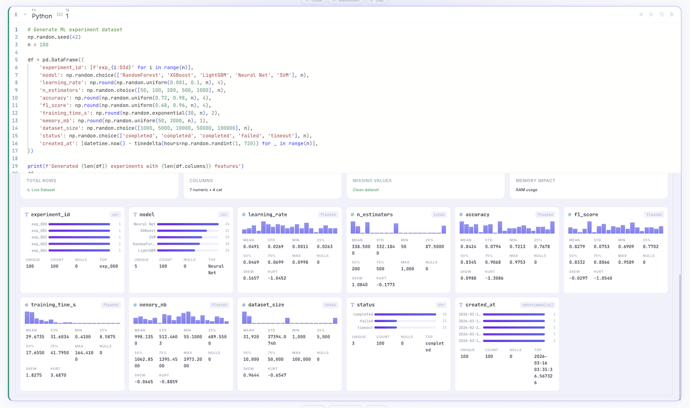
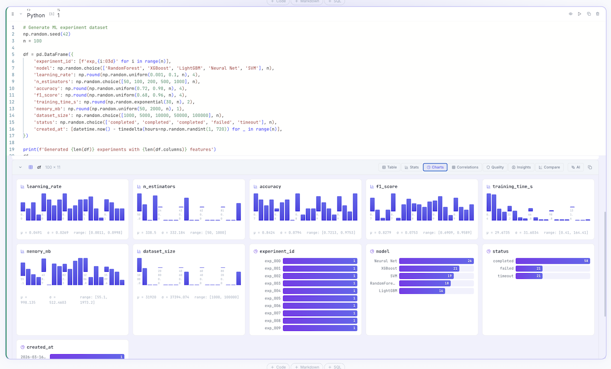
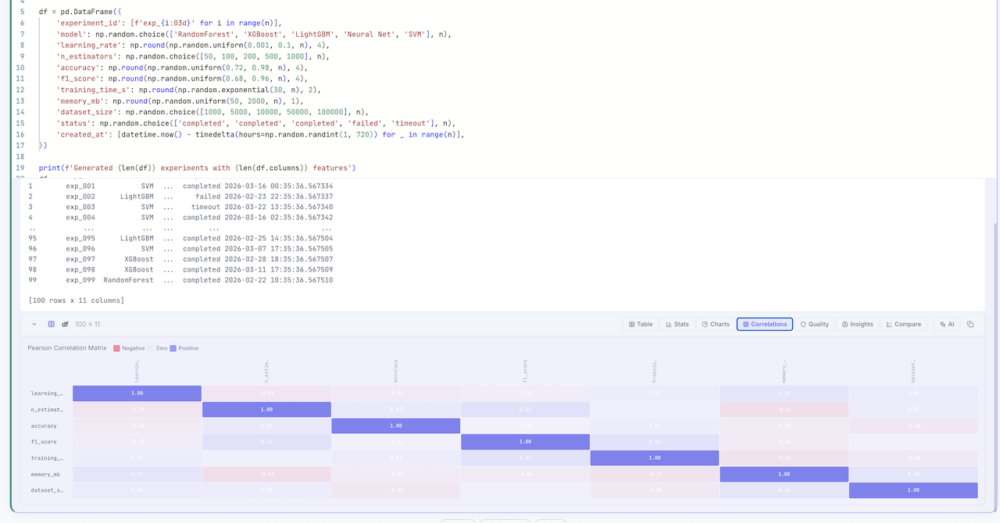
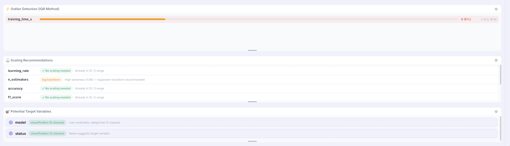

# :mag: Data Exploration

FlowyML Notebook provides a **premium data exploration experience** — every DataFrame gets automatic, multi-tab visual profiling with zero extra code.

---

## Rich Context Display

When you return a DataFrame (Pandas or Polars), FlowyML Notebook automatically generates a **Rich Context Display** with 8 interactive tabs:

| Tab | What It Shows |
|-----|--------------|
| :bar_chart: **Table** | Sortable, paginated data view |
| :chart_with_upwards_trend: **Stats** | Column-level statistics with bento-grid summary |
| :chart: **Charts** | Auto-generated histograms and distribution plots |
| :link: **Correlations** | Pearson correlation heatmap |
| :shield: **Quality** | Missing values, duplicates, data integrity |
| :bulb: **Insights** | Outlier detection, scaling, target suggestions |
| :left_right_arrow: **Compare** | Side-by-side DataFrame comparison |
| :robot: **AI** | AI-powered data analysis |

---

## Stats View

A high-density overview of the most critical metrics: total rows, column count, missing values, and memory impact — plus per-column statistics with type detection.

<figure markdown>
  { width="100%" }
  <figcaption>Bento-grid summary deck with per-column mean, std, min/max, quartiles, skew, and kurtosis</figcaption>
</figure>

---

## Charts View

Auto-generated visualizations for every column. Numeric columns get histograms with µ/σ annotations. Categorical columns get horizontal bar charts with value counts.

<figure markdown>
  { width="100%" }
  <figcaption>Interactive charts: learning_rate, accuracy, f1_score distributions, model counts, status breakdown</figcaption>
</figure>

---

## Correlations

Pearson correlation matrix with color-coded heatmap. Instantly spot positive (purple) and negative (red) relationships between features.

<figure markdown>
  { width="100%" }
  <figcaption>Color-coded correlation matrix with scrollable DataFrame output</figcaption>
</figure>

---

## ML Insights

Automated recommendations for ML preprocessing — no manual analysis needed:

- **:zap: Outlier Detection** — IQR-based detection with percentage and bounds
- **:scales: Scaling Recommendations** — Log transform, no scaling, or normalization suggestions
- **:dart: Target Variables** — Automatically identifies classification and regression targets

<figure markdown>
  { width="100%" }
  <figcaption>training_time_s has 6% outliers, n_estimators needs log transform, model and status identified as targets</figcaption>
</figure>

---

## Built-in Visualization Libraries

In addition to the automatic profiling, FlowyML Notebook includes:

- **Plotly** — Interactive, web-ready charts
- **Matplotlib / Seaborn** — Static, publication-quality plots
- **Altair / Vega** — Declarative statistical visualizations
- **Recharts** — Built-in chart renderer for DataFrame outputs

## Exporting

Every visualization and table can be exported:

- :camera: **Copy as Image** — For presentations or documents
- :floppy_disk: **Export as CSV/Parquet** — For downstream processing
- :bar_chart: **Promote to Dashboard** — Turn exploration cells into interactive dashboards
