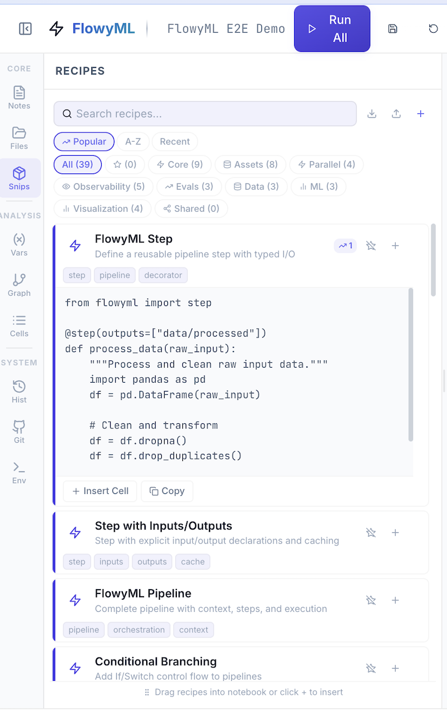

# :cook: Recipes

FlowyML Notebook includes a powerful **Recipe System** — pre-configured, reusable code templates for common ML tasks. Think "snippets on steroids," with usage tracking, team sharing, and automatic surfacing.

---

## Recipe Library

<figure markdown>
  { width="60%" }
  <figcaption>43 built-in recipes organized by category, with search, sort, and one-click insertion</figcaption>
</figure>

### Built-in Categories

| Category | Count | Examples |
|----------|:-----:|---------|
| :star: **Core** | 9 | FlowyML Step, Pipeline, Conditional Branching |
| :package: **Assets** | 8 | Dataset loading, Model versioning, Artifact catalog |
| :fast_forward: **Parallel** | 4 | Parallel map, Dynamic tasks, Map-reduce |
| :eye: **Observability** | 5 | Drift detection, Performance monitoring, Logging |
| :chart_with_upwards_trend: **Evals** | 3 | Eval suites, EvalDataset, Structured assessment |
| :floppy_disk: **Data** | 3 | Data loading, SQL connectors, Parquet I/O |
| :brain: **ML** | 3 | XGBoost/LightGBM baselines, Feature engineering |
| :bar_chart: **Visualization** | 4 | Plotly charts, SHAP/LIME, Dashboard templates |
| :unicorn: **Ecosystem** | 4 | KDP preprocessing, KerasFactory model, MLPotion training, E2E pipeline |

---

## Using a Recipe

1. Open the **Snips** panel in the sidebar
2. Browse or search for a recipe (search filters by name, category, and tags)
3. Click **+** to insert into your notebook at the cursor position
4. Customize the template for your use case

!!! tip "Most Used First"
    Recipes track usage counts automatically. Your most-used recipes surface first in the **Popular** tab — no manual favorites needed.

---

## Creating Custom Recipes

Save any cell as a reusable recipe:

1. Write your code in a cell
2. Click the **"Save as Recipe"** icon in the cell toolbar
3. Provide a **Name**, **Category**, **Tags**, and **Description**

Custom recipes are stored locally as `.recipe.json` files:

```
~/.flowyml/recipes/
├── custom-1711234567890.recipe.json
├── custom-1711234567891.recipe.json
└── usage.json                        # Usage tracking data
```

### Recipe Format

Each recipe is a self-contained JSON file:

```json
{
  "id": "custom-1711234567890",
  "name": "XGBoost Quick Baseline",
  "category": "ML",
  "description": "Train an XGBoost classifier with cross-validation",
  "tags": ["xgboost", "classification", "baseline"],
  "source": "import xgboost as xgb\nfrom sklearn.model_selection import cross_val_score\n\nmodel = xgb.XGBClassifier(n_estimators=100)\nscores = cross_val_score(model, X, y, cv=5, scoring='f1')\nprint(f'F1: {scores.mean():.4f} ± {scores.std():.4f}')",
  "builtin": false,
  "created_at": "2026-03-23T15:00:00",
  "updated_at": "2026-03-23T15:00:00"
}
```

---

## Managing Recipes

### Via Python API

```python
from flowyml_notebook.recipes_store import RecipeStore

store = RecipeStore()

# List all custom recipes (with usage counts)
recipes = store.list_recipes()

# Save a new recipe
store.save_recipe({
    "name": "My Custom Pipeline",
    "category": "Core",
    "tags": ["pipeline", "custom"],
    "source": "from flowyml import pipeline\n\n@pipeline\ndef my_pipeline():\n    ...",
})

# Track usage (called automatically when inserted)
store.track_usage("custom-1711234567890")

# Delete a recipe
store.delete_recipe("custom-1711234567890")
```

### Import & Export

Move recipes between machines or share outside of GitHub:

```python
# Export all recipes as JSON
all_recipes = store.export_all()

# Import recipes from another source
store.import_recipes(imported_list, overwrite=False)
```

---

## Sharing Recipes via GitHub

When connected to a GitHub repository (see [Collaboration](collaboration.md)), recipes can be pushed to the shared team hub:

| Method | How |
|--------|-----|
| **Push to Hub** | Toggle "Share to Hub" when saving → recipe is committed to `.flowyml-hub/recipes/` |
| **Pull from Hub** | Click Pull in Git panel → team recipes appear in the Shared tab |
| **Manual Export** | Export as JSON and share directly |

### Shared Recipe Catalog

The hub maintains a `catalog.json` index for fast browsing:

```json
{
  "recipes": [
    {
      "id": "xgboost-baseline",
      "name": "XGBoost Quick Baseline",
      "category": "ML",
      "description": "Train an XGBoost classifier with CV",
      "tags": ["xgboost", "baseline"],
      "shared_by": "alice",
      "shared_at": "2026-03-23T15:00:00"
    }
  ],
  "updated_at": "2026-03-23T15:00:00"
}
```

When a teammate pushes a recipe, it appears in the **Shared** tab for everyone who pulls.

---

## Best Practices

!!! tip "Recipe Tips"
    - **Name clearly** — `XGBoost Quick Baseline` > `my_model`
    - **Tag generously** — Tags power search: `["xgboost", "classification", "baseline"]`
    - **Keep focused** — One recipe = one task. Don't mix data loading with model training
    - **Document parameters** — Use comments to explain what to customize
    - **Share to Hub** — If it helped you, it'll help your team

---

## :unicorn: UnicoLab Ecosystem Recipes — NEW in v1.3

FlowyML Notebook v1.3 adds **4 builtin ecosystem recipes** that provide ready-to-use workflows for the UnicoLab ML stack:

| Recipe | Package | What It Does |
|--------|---------|-------------|
| :test_tube: **KDP Smart Preprocessing** | `kdp` | Auto-configure Keras preprocessing layers — feature types, distribution-aware encoding, tabular attention |
| :building_construction: **KerasFactory Quick Model** | `kerasfactory` | Build tabular models with `BaseFeedForwardModel` or custom GRN/attention architectures |
| :alembic: **MLPotion Training Pipeline** | `mlpotion` | Managed training with `ModelTrainer` and type-safe `ModelTrainingConfig` |
| :unicorn: **UnicoLab End-to-End Pipeline** | All 3 | Complete KDP → KerasFactory → MLPotion workflow in one recipe |

Ecosystem recipes appear alongside your custom and shared recipes in the **Snips** panel. They are tagged with `unicolab` for easy search.

### Installing Ecosystem Packages

```bash
pip install "flowyml-notebook[keras]"
```

See [Ecosystem](ecosystem.md) for the full integration guide.
